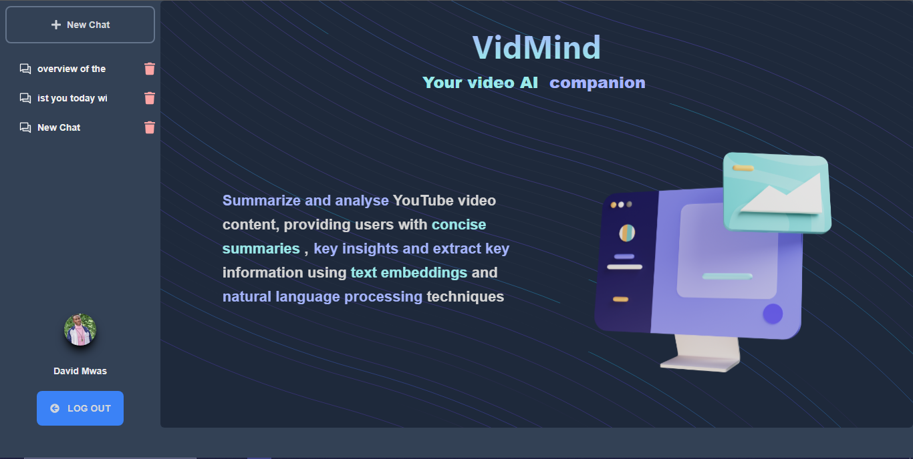

# Tutorial converter

## Your video AI companion

Tutorial converter is a system designed to automatically summarize, analyze, and extract key information from YouTube video content. By leveraging text embeddings and natural language processing techniques, Tutorial converter aims to provide users with concise summaries and key insights, reducing the need for manual video viewing and note-taking.

## Table of Contents

- [Introduction](#introduction)
- [Problem Statement](#problem-statement)
- [Solution Overview](#solution-overview)
- [Aims and Objectives](#aims-and-objectives)
- [Methodology](#methodology)
- [System Requirements](#system-requirements)
- [System Benefits](#system-benefits)
- [Budget](#budget)
- [Schedule](#schedule)
- [References](#references)

## Introduction

Tutorial converter is developed to address the challenge of information overload in video content, particularly on platforms like YouTube. By automating video comprehension and summarization, Tutorial converter aims to enhance efficiency and productivity for users seeking to extract key information quickly from videos.

## Problem Statement

The abundance of video content on platforms like YouTube makes it difficult for users to efficiently extract key information and insights. Manual video viewing and processing are time-consuming and often inefficient. Tutorial converter addresses this challenge by automating video summarization and analysis.

## Solution Overview

Tutorial converter extracts video transcripts using YouTube's API, generates text embeddings using OpenAI API or Gemini API, stores these embeddings in a vector database (such as Astra DB), and applies natural language processing techniques to generate concise summaries. The system then presents these summaries and key insights to users through an intuitive interface.

## Aims and Objectives

### Aim

To automate the understanding of YouTube video content, providing users with concise summaries, key insights, and extracted key information.

### Objectives

1. Analyze the performance of OpenAI API and Gemini API for video transcript embedding.
2. Design a system architecture for embedding generation, storage, and analysis.
3. Develop a user-friendly interface for interacting with the system.
4. Evaluate the accuracy and effectiveness of generated summaries.

## Methodology

Tutorial converter employs a prototyping approach, iteratively refining the system based on user feedback to ensure that the final product aligns with user needs and expectations.

## System Requirements

### Technical Requirements

- Node.js (Backend)
- EJS (templating engine), React (Frontend)
- AstraDB or Redis (vector database)
- OpenAI API or Gemini API
- YouTube Data API (Transcript API)
- Additional libraries for Natural Language Processing (voice and speech recognition)

### Functional Requirements

- Extract video transcripts from YouTube URLs.
- Generate text embeddings from transcripts.
- Store and retrieve embeddings from AstraDB, vector database.
- Generate summaries of video content.
- Present summaries and key insights in a user-friendly interface.

### Non-Functional Requirements

- User-friendly interface
- High performance and response time
- Secure storage of data
- Reliability and accessibility

## System Benefits

- Rapid comprehension of video content without manual viewing
- Time savings for users seeking key information
- Improved decision-making based on extracted insights

## References

- [OpenAI API documentation](https://openai.com/)
- [Gemini API documentation](https://deepmind.google/technologies/gemini/#bard/)
- [AstraDB documentation](https://astra.datastax.com/)
- [YouTube Data API documentation](https://console.cloud.google.com/apis/api/youtube.googleapis.com/)
- Research papers on text embeddings and video summarization
